# 99도씨: 배달용기 수거 서비스
> 2021.06 – 2021.08 | 개발팀 개약직

 

- [🧑‍💻 담당 역할](#-담당-역할)
- [🏆 주요 성과](#-주요-성과)
- [🛠️ 주요 기술](#️-주요-기술)
- [📊 ERD](#-erd)
- [🎵 99도씨 화면](#-99도씨-화면)
  - [📍 손님](#-손님)
  - [📍 피커](#-피커)
  - [📍 관리자](#-관리자)

 

## 🧑‍💻 담당 역할
- 풀스택 유지보수 및 기능 확장

 

## 🏆 주요 성과
- Node.js Express 기반 REST API 서버, EJS 기반 서버사이드 렌더링(SSR) 웹 서버 구현
- 손님 페이지 UI 개선, 환급 이벤트 기능 추가
- 관리자의 효율적인 데이터 관리를 위해 배달용기 식별 번호 체계, 논리적 삭제 도입
- 이벤트 스케줄러로 배달용기 상태 자동 업데이트
- Google Maps API 활용
- 도메인 구매 및 Google 관리형 SSL 적용으로 보안 강화

 

## 🛠️ 주요 기술
**Frontend**

**Backend**

 

## 📊 ERD

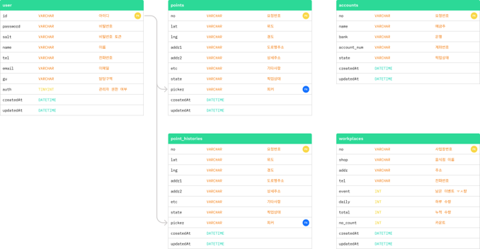

 

## 🎵 99도씨 화면
### 📍 손님

| 음식점 선택 | 회수 주소 등록 | 환급 이벤트 | 완료 페이지 |
|:---:|:---:|:---:|:---:|
| 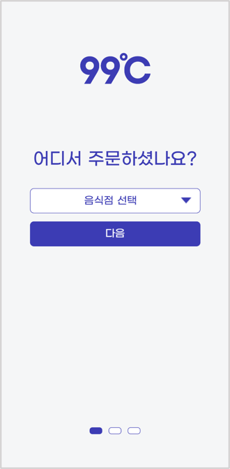 | 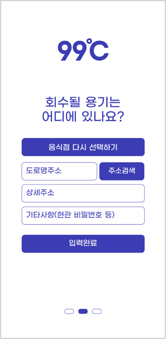 | 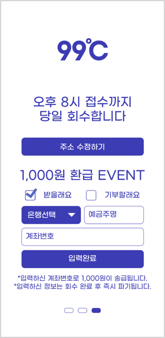 | 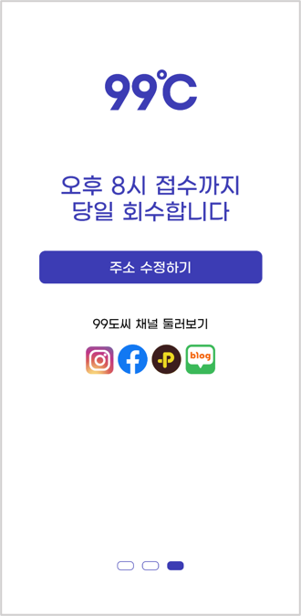 |

### 📍 피커
| 오늘 대기/예약 목록 | 오늘 회수/분실 목록 | 지도 | 과거 회수 목록 |
|:---:|:---:|:---:|:---:|
| 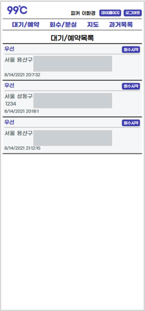 |  | 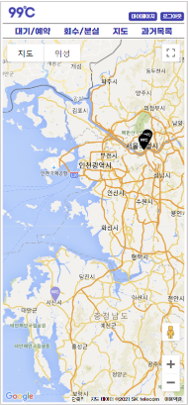 |  |

 

### 📍 관리자
| 회수 목록 | 지도 | 음식점 목록 |
|:---:|:---:|:---:|
| 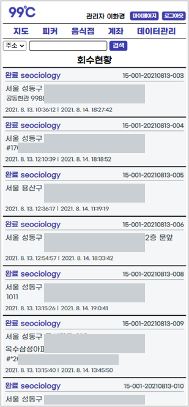 | 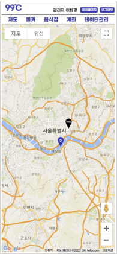 | 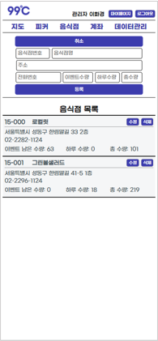 |

| 계좌 목록 | 데이터 관리 페이지 |
|:---:|:---:|
| 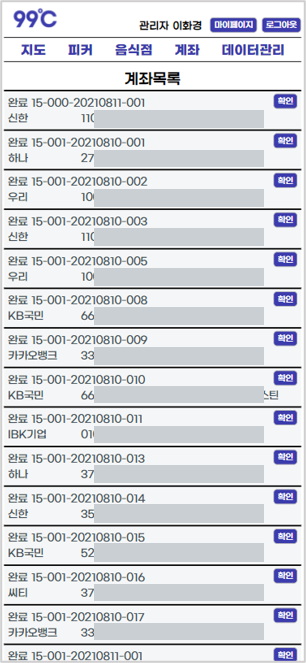 | 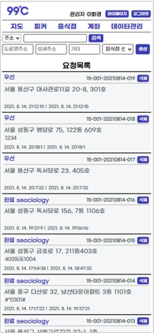 |
 
