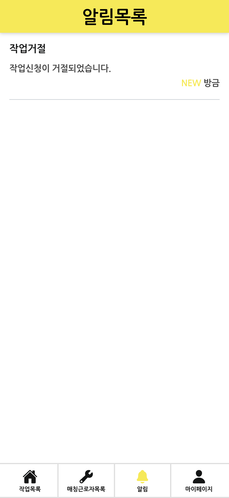

# 빌드매치: 직업소개소 모바일/PC 겸용 IT 자동화 시스템
> 2023.01 ~ 2023.03 | ㈜몽키소프트 연구개발부 사원
 

- [🧑‍💻 담당 역할](#🧑‍💻-담당-역할)
- [🏆 주요 성과](#🏆-주요-성과)
- [🛠️ 주요 기술](#️🛠️-주요-기술)
- [🎵 빌드매치 화면](#🎵-빌드매치-화면)
  - [📍 사용자(구인자)](#📍-사용자(구인자))
  - [📍 근로자(구직자)](#📍-근로자(구직자))
  - [📍 관리자](#📍-관리자)

 

## 🧑‍💻 담당 역할
- 구인자, 구직자용 웹 앱 프론트엔드 개발
- 전체 테스트 및 문서 작업

 

## 🏆 주요 성과
-  프론트엔드 핵심 기능 모듈 설계 및 구현(network, validator, converter, render, 
handler)
- FileFond 라이브러리를 활용한 이미지 업로드 풀스택 개발
- 클라이언트 사이드 렌더링, 페이지네이션과 동적 데이터 로딩 구현
- API 문서, 카탈로그, 리플렛, 사용자 매뉴얼 작성

 

## 🛠️ 주요 기술
**Frontend**

**Backend**

 

## 🎵 빌드매치 화면
### 📍 사용자(구인자)
| 메인화면 | 작업신청 |
|:---:|:---:|
|  |    |

| 작업목록 | 작업상세 | 매칭근로자목록 | 근로자상세 |
|:---:|:---:|:---:|:---:|
|  |  |  |  |

| 알림목록 | 마이페이지 |
|:---:|:---:|
|  |  |

 

### 📍 근로자(구직자)
| 로그인 | 매칭목록 | 매칭수락 및 거절 | 마이페이지 |
|:---:|:---:|:---:|:---:|
|  |  |  |  |

 

### 📍 관리자
| 근로자목록 | 매칭목록 |
|:---:|:---:|
|  |  | 

| 사용자목록 | 작업목록 |
|:---:|:---:|
|  |  |