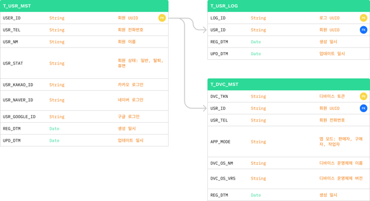

# 카우잇츠: 조사료 생산일지 및 유통 관리 앱 
> 2023.07 ~ 2023.08 | ㈜몽키소프트 연구개발부 사원
 

- [🧑‍💻 담당 역할](#🧑‍💻-담당-역할)
- [🏆 주요 성과](#🏆-주요-성과)
- [🛠️ 주요 기술](#️🛠️-주요-기술)
- [📊 ERD](#📊-erd)
- [🔑 로그인 프로세스](#🔑-로그인-프로세스)

 

## 🧑‍💻 담당 역할
- 카카오, 네이버, 구글 로그인 프론트/백엔드 개발

 

## 🏆 주요 성과
- OAuth 로그인 구현
- JWT 기반 인증 및 보안 강화

 

## 🛠️ 주요 기술
**Frontend**

**Backend**

 

## 📊 ERD

 

## 🔑 로그인 프로세스

