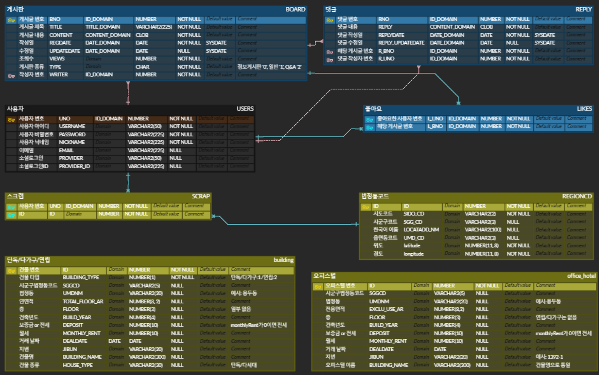

# 자취플랜: 전월세 평균가 및 자취 커뮤니티

 

- [📘 프로젝트 개요](#📘-프로젝트-개요)
- [🧑‍💻 팀원 역할 분배](#🧑‍💻-팀원-역할-분배)
- [🛠️ 주요 기술](#️🛠️-주요-기술)
- [📊 ERD](#📊-erd)
- [🎵 자취플랜 화면](#🎵-자취플랜-화면)

 

## 📘 프로젝트 개요

### 🕑 프로젝트 기간
2024.12.16 ~ 2025.01.06 (3주)

 

### 💁 팀원 소개
|팀장|팀원|팀원|팀원|
|:---:|:---:|:---:|:---:|
|||||
|[이재혁](https://github.com/Jaehyuk-Lee)|[김성현](https://github.com/seonghyuning)|[김정은](https://github.com/jjoool)|[이화경](https://github.com/hwakyung99)

 

### 🏅 배경 및 기대효과
**배경**
- 자취를 처음 시작하는 2-30대를 위한 각 지역의 월세/전세 정보를 한눈에 확인할 수 있는 효율적인 정보를 제공 
- 자취 생활과 관련된 정보 공유와 소통이 가능한 커뮤니티를 제공하여 자취생 간의 네트워크를 형성

**기대효과**
- 자취 희망자의 정보 탐색 시간 절약
- 자취 생활의 질과 지식 향상

 

### 🪄 주요 기능
- **전월세 평균가 지도 및 그래프**
- **지역 스크랩**
- **자취 관련 커뮤니티**

 

## 🧑‍💻 팀원 역할 분배

 

## 🛠️ 주요 기술
**Frontend**

**Backend**

 

## 📊 ERD

 

## 🎵 자취플랜 화면
### 📍 메인화면

 

### 📍 로그인

 

### 📍 커뮤니티

 

### 📍 게시판 상세페이지

 

### 📍 지역 스크랩

 

### 📍 게시글 좋아요

 
