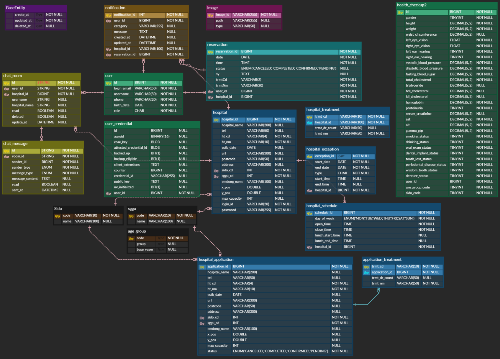

# OnCare: 온라인 병원 예약 및 개인 건강 관리 서비스

 

- [📘 프로젝트 개요](#📘-프로젝트-개요)
- [🧑‍💻 팀원 역할 분배](#🧑‍💻-팀원-역할-분배)
- [🛠️ 주요 기술](#️🛠️-주요-기술)
- [📊 ERD](#📊-erd)
- [🏛️ 시스템 아키텍쳐](#🏛️-시스템-아키텍쳐)
- [🎵 OnCare 서비스 화면](#🎵-oncare-서비스-화면)

 

## 📘 프로젝트 개요

### 🕑 프로젝트 기간
2025.02.10 ~ 2025.03.12 (4주)

 

### 💁 팀원 소개
|팀장|팀원|팀원|
|:---:|:---:|:---:|
||||
|[이화경](https://github.com/hwakyung99)|[김정은](https://github.com/jjoool)|[차현철](https://github.com/bright-cha)|

 

### 🏅 배경 및 기대효과
**배경**
- CES 2025의 핵심 키워드로 '디지털 헬스케어' 선정, 글로벌 트렌드에 발맞춰 디지털 헬스케어 시장의 급성장과 증가하는 수요에 선제적 대응 
- 기존 병원 예약 시스템의 불편함을 해소하고 사용자 중심의 개인 맞춤형 건강 관리 서비스 제공 필요 

> "기존 예약 시스템이 너무 불편하고 복잡해요. 더 간편하고 내게 맞는 건강 관리 서비스는 없을까요?" 
> "내 건강 상태를 정확히 알고 맞춤형 관리로 건강을 챙기고 싶어요!"

이러한 고민을 해결하고자 **개인 맞춤형 디지털 헬스케어 서비스**가 탄생했습니다.

**기대효과**
- 병원 운영 효율성 증가
- 의료 서비스 접근성 향상
- 개인 건강 관리 효율성 증대

이제, 병원과 개인 모두가 스마트하게 건강을 관리할 시간입니다! 🚀

 

### 🪄 주요 기능
- **병원 찾기**
- **온라인 병원 예약**
- **실시간 채팅**
- **건강 검진 결과 시각화**

 

## 🧑‍💻 팀원 역할 분배

 

## 🛠️ 주요 기술
**Frontend**

**Backend**

 

## 📊 ERD

 

## 🏛️ 시스템 아키텍쳐

 

## 🎵 OnCare 서비스 화면
### 📍 메인화면(일반 사용자)

 

### 📍 카카오 로그인

 

### 📍 패스키 로그인

 

### 📍 병원 찾기

 

### 📍 병원 상세페이지

 

### 📍 진료 예약

 

### 📍 예약 내역

 

### 📍 채팅

 

### 📍 채팅 검색

 

### 📍 SSE 알림

 

### 📍 건강 검진 내역 조회

 

### 📍 리뷰 및 즐겨찾기

 

### 📍 병원 등록 신청

 

### 📍 병원 관리(서비스 관리자)

 

### 📍 로그인 및 설정(병원 관리자)

 

### 📍 예약 관리(병원 관리자)

 
